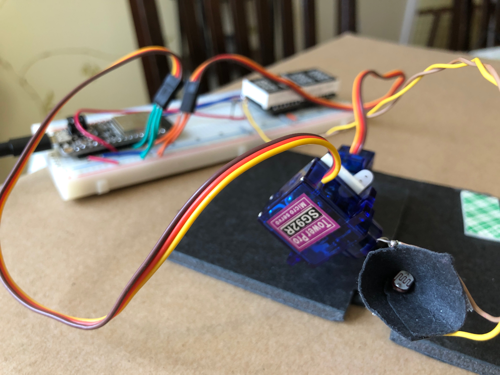

# Solar Tracker

Authors: Maxwell Bakalos, Emre Karabay, Miguel Ianus-Valdiva

Date: 2023-2-15

### Summary

### Self-Assessment 

| Objective Criterion | Rating | Max Value  | 
|---------------------------------------------|:-----------:|:---------:|
| 1. Keeps track of time using hardware timer | 1 |  1     | 
| 2. Measures input from solar cell | 1 |  1     | 
| 3. Finds azimuth and altitude at maximum intensity | 1 |  1     | 
| 4. Drives two servos to position of maximum intensity | 1 |  1     | 
| 5. Cyclic behavior at design frequency driven by clock (not delays) | 1 |  1     | 
| 6. Reports results on display in degrees  | 1 |  1     | 

### Solution Design

This project was created by programming the ESP32 microcontroller in C. Two servos (each with a 180° range) are used to point a photoresistor toward the direction of greatest brightness. There are two tasks that run via FreeRTOS in this design:

**TASK 1:**  
Every 10 seconds a timer interrupt sets a global variable to true and triggers the light search process.

**TASK 2:** 
If the trigger is activated, the ESP32 samples a photoresistor and stores those samples in a sliding window as it moves across its rotational range. Once it detects that the brightness is decreasing, it stops and finds the maximum brightness in the window, then moves to that angle.    

This repeats for the azimuth and altitude and then once again for the azimuth (redundancy) to make sure the true maximum angles are found. As this process occurs, the azimuth & altitude angles are displayed on a 14-segment alphanumeric display. Due to the display only having 4 digits, the absolute values of the angles are displayed (-90° to 90°).

### Sketches/Diagrams

Photo of Solar Tracker

### Supporting Artifacts
- Technical Presentation: https://drive.google.com/file/d/1Y_ZIFBd358TcTIxwNPBsxReSCSffHqh6/view?usp=share_link
- Video Demo: https://drive.google.com/file/d/17g9OgLx2nZTP8Kzh1uSnudWER-i7OE7v/view?usp=share_link

### Modules, Tools, Source Used Including Attribution
All of the skills in Quest 1 were used: UART Serial Communication, Alphanumeric Display, Voltage Reader, Servos, FreeRTOS Tasks, and Timer Interrupts.

### References

